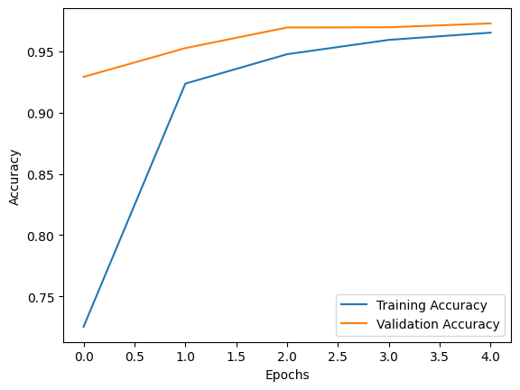

# MNIST Digit Recognition using Convolutional Neural Network (CNN)

## Overview 📖
This project is a beginner-friendly exploration of deep learning concepts through a classic problem: recognizing handwritten digits. Using the MNIST dataset, we built a convolutional neural network (CNN) model in TensorFlow that accurately classifies digits from 0 to 9. This project serves as a hands-on introduction to feature extraction, CNN architectures, and neural network training.

## Dataset 📊
The MNIST dataset consists of 60,000 training images and 10,000 testing images of handwritten digits, with each image sized at 28x28 pixels. TensorFlow provides an easy-to-access version of the dataset, which is pre-split into training and testing sets.

## Project Structure 📂
```plaintext
├── MNIST_Digit_Recognition_using_CNN.ipynb  # Main Jupyter Notebook with code and explanations
├── README.md                                # Project documentation
└── results/                                 # Folder for storing model accuracy plots and sample predictions
```

## Model Architecture 🧠
The model is a simple yet powerful CNN, with the following layers:
- **Conv2D layers** for extracting features (e.g., edges and shapes) from images.
- **MaxPooling2D layers** for reducing spatial dimensions.
- **Dense (Fully Connected) layers** for final classification.

### Layer Details:
1. **Conv2D Layer**: Detects features with 32 filters and a 3x3 kernel.
2. **MaxPooling2D Layer**: Reduces dimensions by taking the maximum in a 2x2 pool.
3. **Flatten Layer**: Converts 2D matrix data to a 1D vector.
4. **Dense Layer**: Fully connected layer with 64 neurons.
5. **Output Layer**: A softmax layer with 10 neurons (one per digit).

## Requirements 🛠
- Python 3.x
- TensorFlow
- Matplotlib

Install dependencies using:
```bash
pip install tensorflow matplotlib
```

## Running the Project 🚀

1. **Clone the repository**:
   ```bash
   git clone https://github.com/Abdullah007bajwa/MNIST-Digit-Recognition-using-Convolutional-Neural-Network-CNN-.git
   cd MNIST-Digit-Recognition-using-Convolutional-Neural-Network-CNN-
   ```

2. **Run the Notebook**:
   Open `MNIST_Digit_Recognition_using_CNN.ipynb` in Jupyter Notebook, Colab, or any other notebook-compatible platform and run the cells in order.

## Results 📈
- The model achieved an impressive test accuracy of **~96.82%** after 5 epochs.
- Training and validation accuracy plots are provided to visualize learning performance.
- Sample predictions on test images display the model’s predictions along with true labels.

## Key Learnings 🧑‍🏫
This project helped reinforce concepts of CNNs, such as:
- Convolutional layers and their role in feature detection.
- Importance of activation functions like ReLU.
- Utility of pooling layers for dimensionality reduction.
- Final dense layers that transform learned features into classification outputs.

## Sample Predictions 📷
Below are some of the model's predictions on test samples, showing its accuracy in recognizing handwritten digits.





## Future Improvements 🔧
- **Data Augmentation**: Augmenting images (e.g., rotations, shifts) to improve generalization.
- **Hyperparameter Tuning**: Experimenting with different architectures and parameters.
- **Additional Layers**: Adding more convolutional layers for deeper feature extraction.

## Repository 📂
[GitHub Repository](https://github.com/Abdullah007bajwa/MNIST-Digit-Recognition-using-Convolutional-Neural-Network-CNN-)

## Acknowledgments 🙏
Thanks to TensorFlow for providing easy access to the MNIST dataset and tools to streamline the deep learning process.
